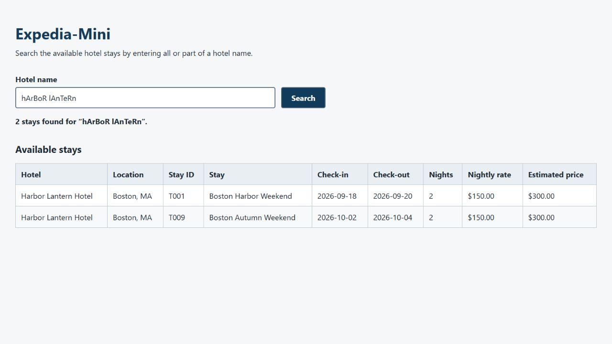
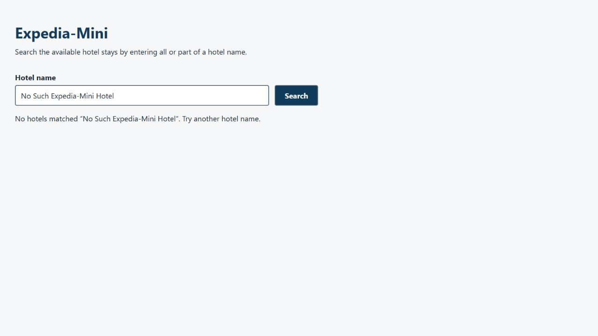
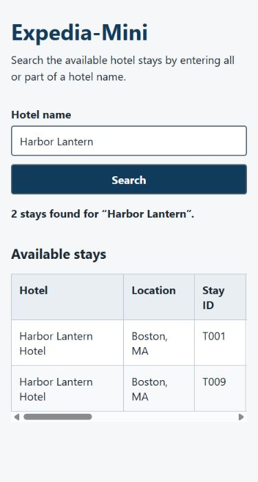

# Expedia-Mini — Part 1

## Repository and commit

- GitHub repository URL:
  [https://github.com/soumetsu/expedia-mini](https://github.com/soumetsu/expedia-mini)
- Exact submitted Part 1 implementation commit:
  [`73fee4df1db360c8c8506f5df5b4d56dbdc060e0`](https://github.com/soumetsu/expedia-mini/commit/73fee4df1db360c8c8506f5df5b4d56dbdc060e0)

## Implementation

Expedia-Mini implements the Part 1 hotel-stay search as a Vue-to-FastAPI flow.
The Vue 3 interface accepts a full or partial hotel name, prevents blank
submission, supports Enter and button submission, and presents separate
loading, success, no-results, validation, and API-error states. Matching stays
appear in a semantic table that remains horizontally scrollable on a narrow
screen.

Frontend responsibilities are separated by module. `frontend/src/App.vue`
owns page-level query and request state. `HotelSearchForm.vue` owns accessible
input and submission behavior. `HotelResultsTable.vue` renders hotel name,
city/state, stay ID and name, check-in, check-out, nights, nightly rate, and
estimated price. `frontend/src/services/api.js` encodes the search value,
requests `/api/hotels/search`, and validates the response envelope. Vite proxies
same-origin `/api` requests to `http://127.0.0.1:8000` during local development.

FastAPI owns HTTP input validation, response contracts, status handling, and
generated documentation. Backend modules separately own route configuration,
Pydantic models, stable-path CSV loading and validation, and hotel/trip joining.
The backend reads the unchanged UTF-8-with-BOM `hotels.csv` and `trips.csv`,
matches hotel names case-insensitively and partially, joins all stays through
`hotel_id`, calculates nights and estimated prices, and returns one flattened
response row per stay. The browser does not read CSV files directly.

Official Prompt 02 completed the approved project-local environments. Prompt 03
completed the tested FastAPI CSV search. Prompt 04 completed the barebones Vue
integration and automated browser checks. The completed Part 1 checkpoint was
published afterward. No SQLite, booking, final-design, or image-selection work
was performed.

## Verification

The observations below were made by automated commands and browser control.
They are not claims of user or developer manual review.

| Action | Expected result | Observed result |
| --- | --- | --- |
| Check project Python | Identify the interpreter and compatible version | Passed; `backend/.venv/Scripts/python.exe` uses Python 3.13.15 (64-bit) |
| Import backend packages | FastAPI and Uvicorn import from the project environment | Passed; FastAPI 0.141.1 and Uvicorn 0.52.4 |
| Check frontend package readiness | Existing project-local Vue/Vite packages resolve | Passed; Vue 3.5.42, Vite 7.3.6, and `@vitejs/plugin-vue` 6.0.8 were reported by `npm ls --depth=0` |
| Inspect frontend scripts | Identify configured dev, lint, test, and build commands | `dev`, `build`, and `preview` exist; no lint or frontend test script is configured |
| Inspect generated OpenAPI contract | Confirm the response envelope and every stay field | Passed; the schema requires `query`, `count`, and `results`, with all 11 documented stay fields |
| Run backend automated tests | Data, search, response, and route behavior pass | Passed in Prompt 03; all 12 standard-library `unittest` tests passed in 0.055 seconds on the final run |
| Build the Vue frontend | Vite production build completes | Passed on the first run; 13 modules transformed and output written to ignored `frontend/dist/` in 3.73 seconds |
| Run frontend lint | Run lint when configured | Not run; the project has no lint script |
| Run frontend tests | Run tests when a framework is already configured | Not run; the project has no frontend test script or test framework |
| Check local service ports | Ports 8000 and 5173 are free before startup | Passed; both ports were available and no process was stopped |
| Smoke-check backend health | Health returns HTTP 200 and `{"status":"ok"}` | Passed exactly as expected |
| Smoke-check successful API search | Mixed-case `hArBoR lAnTeRn` returns both H001 stays | Passed with HTTP 200, count 2, and trip IDs T001 and T009 |
| Smoke-check empty API search | Unknown hotel returns a successful empty response | Passed with HTTP 200, count 0, and an empty results list |
| Load the Vue page | App name, description, labeled input, and button appear without an app error | Passed under automated browser control |
| Prevent a blank search | No request is submitted and useful validation appears | Passed; `Enter a hotel name to search.` appeared and focus returned to the input |
| Submit with Enter | Whitespace is trimmed and the search completes without a page reload | Passed using whitespace-padded `hArBoR lAnTeRn`; the input normalized and count 2 appeared |
| Compare successful table with API | T001/T009 and displayed stay values match the direct API response | Passed; both rows showed Boston, MA, the correct stay names/dates, 2 nights, $150.00 nightly, and $300.00 estimated price |
| Replace results with an empty search | Previous rows disappear and clear empty feedback appears | Passed using `No Such Expedia-Mini Hotel` |
| Exercise API failure feedback | A failed request is distinct from an empty success | Passed after briefly stopping only the task-owned backend; the useful API-error message appeared, and the backend was restarted |
| Check narrow viewport | The form stays usable and the table does not widen the page | Passed at 375×700; the table stayed inside a keyboard-focusable horizontal scroll region |
| Inspect browser console | A clean final success run has no unexpected warnings or errors | Passed; the clean final tab reported no warning or error entries |
| Confirm final services | Backend and frontend remain reachable for manual inspection | Passed; FastAPI listens on 127.0.0.1:8000 and Vite on 127.0.0.1:5173 at the end of Prompt 04 |
| Publish the Part 1 checkpoint | The implementation commit is available on GitHub | Passed; `main` was published at `73fee4df1db360c8c8506f5df5b4d56dbdc060e0` |

No frontend source-code correction cycle was needed; the production build
passed on its first run. The deliberately induced backend-off request produced
the expected proxy/request failure only; a fresh browser run after restart had
no warning or error console entries.

### Automated browser evidence

These repository-relative images are instructor-accessible from the published
repository.

## Project context and next steps

- [README](README.md)
- [Project rules](AGENTS.md)
- [Design note](docs/design.md)
- [Verification guide](docs/verification.md)
- Selected prompts: [project setup and development](prompts/01-project-setup-and-development.md),
  [complete project-local environments](prompts/02-complete-project-local-environments.md),
  [Part 1 backend CSV search](prompts/03-part-1-backend-csv-search.md), and
  [Part 1 frontend CSV search](prompts/04-part-1-frontend-csv-search.md)
- [Current handoff](handoffs/current.md)

The Part 1 CSV search is implemented end to end. Remaining limitations are the
missing frontend lint/test setup and the shell-specific Node/npm
command-discovery issue. The interface is deliberately barebones; final visual
styling and selection/copying of any application images belong in a later
design prompt. SQLite and booking features remain Part 2 work.
